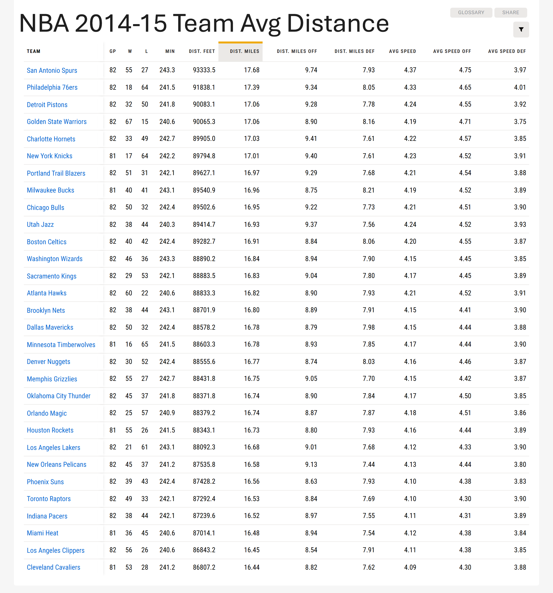
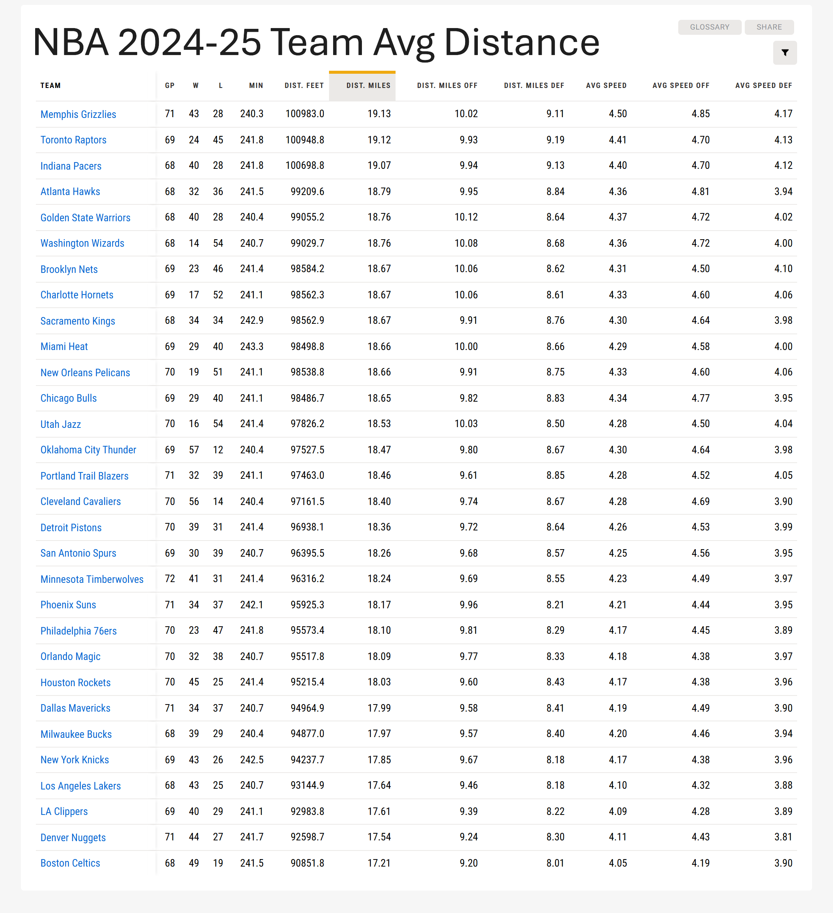

[JJ Redick in a post game interview commenting about the physical demands of today's game](https://www.reddit.com/r/nba/comments/1jgpic4/jj_redick_speaks_on_how_the_game_has_evolved_with/) (emphasis mine):

> The game that exists today, and the modern NBA player, I wouldn't be either, if this is what I came up in. [...] The game doesn't allow you to play 6 games in 8 nights. It's just not possible. [...] **It was an easier game to play then, because there wasn't as much movement and there wasn't as much spacing and you didn't have to cover as much of the court.** [...] The old heads are gonna talk about how physical it was in the 80s and 90s and that's fine but the level of physicality in our game and the way the court has to be covered and all the movement, it's tough.

It's a great point and something I've argued many times. But I wanted to know if this could be quantified. Fortunately for this nerd, it can. NBA.com has speed and distance data going back to the 2013-14 season. Comparing the average distance traveled per team for [this season](https://www.nba.com/stats/teams/speed-distance?dir=D&sort=DIST_MILES) to [10 years ago](https://www.nba.com/stats/teams/speed-distance?Season=2014-15&dir=D&sort=DIST_MILES), the gap is huge:

- 2024-25
    - Most miles per game: 19.13 (Grizzlies)
    - Least miles per game: 17.21 (Celtics)
    - Average miles per game: **18.35**
- 2014-15
    - Most miles per game: 17.68 (Spurs)
    - Least miles per game: 16.44 (Cavs)
    - Average miles per game: **16.83**

<figure>

</figure>
<figure>

</figure>

The Spurs, who ran the most miles in 2014-15, would barely be 25th this season! If the gap is this wide in only 10 years, imagine how large it would be compared to 20 or even 30 years ago. It's clear that even though there is less physical contact in today's game, the physical demands on a player's body are far greater.