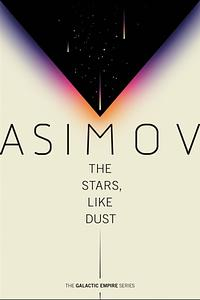
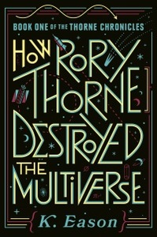
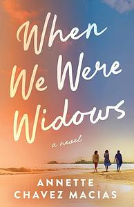

I enjoy a good book challenge but some of them are just too daunting (I'm looking at you, r/fantasy). Fortunately this year I found the [What's in a Name Challenge](https://carolinabooknook.wordpress.com/2024/12/26/whats-in-a-name-2025-sign-up/), where each book title must contain the prompt. The challenge is hosted by Andrea at [Carolina Book Nook](https://carolinabooknook.wordpress.com) and runs from January 1, 2025 to December 31, 2025. 

The rules are simple:

- Read a book in any format (hard copy, ebook, audio) with a title that fits into each category.
- Don’t use the same book for more than one category.
- Creativity for matching the categories is not only allowed, it’s encouraged!
- You can choose your books as you go or make a list ahead of time.

In 2025, choose 6 books that have titles that contain:

## Cardinal direction ✅

>Titles for this category need to include at least one cardinal direction (North, East, South, West) in the title.

<figure>
    
    <figcaption>
        <cite>Exit West</cite>, by Mohsin Hamid   
        Completed Dec 13, 2025
    </figcaption>
</figure>

## Wanderlust ✅

>Titles for this category need to include words or phrases related to wanderlust: wander, journey, trip, travel, explore, trek, tour, adventure, etc. Or the implication of traveling or exploring.

<figure>
    
    <figcaption>
        <cite>The Stars, Like Dust</cite>, by Isaac Asimov   
        Completed Jan 29, 2025
    </figcaption>
</figure>

## First and last name ✅

>Titles for this category need to include both a first name (given name) and last name (surname). The names don’t matter, as long as it’s the first and last of a real person or fictional character.

<figure>
    
    <figcaption>
        <cite>How Rory Thorne Destroyed the Multiverse</cite>, by K. Eason 
        Completed Aug 25, 2025
    </figcaption>
</figure>

## Alliteration ✅

>Titles for this category need to include at least two main words that begin with the same letter.

<figure>
    
    <figcaption>
        <cite>When We Were Widows</cite>, by Annette Chavez Macias 
        Completed Jan 6, 2025
    </figcaption>
</figure>

## Deity ✅

>Titles for this category need to include words associated with a deity of some sort. This can be the words “deity,” “god,” “goddess,” or a specific name of a deity. In your comment, please include the culture or religion of the deity (even if the deity isn’t being directly referenced.)

<figure>
    
    <figcaption>
        <cite>The Atlas Six</cite>, by Olivie Blake 
        Completed Jul 21, 2025 
    </figcaption>
</figure>

## Crime ✅

>Titles for this category need to include the word “crime,” a specific type of crime, a specific type of criminal, or the name of an infamous criminal.

<figure>
    
    <figcaption>
        <cite>Kill Girl</cite>, by Jill M. Beene 
        Completed Mar 31, 2025
    </figcaption>
</figure>

